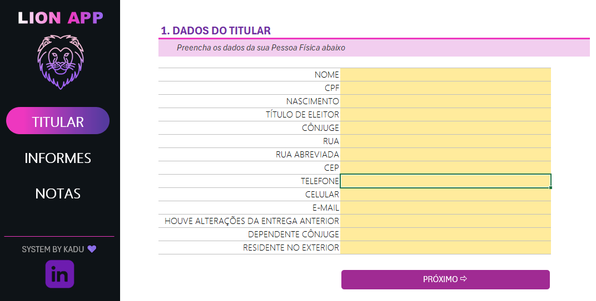
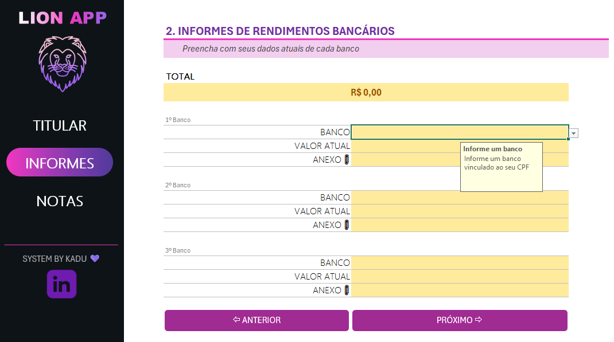
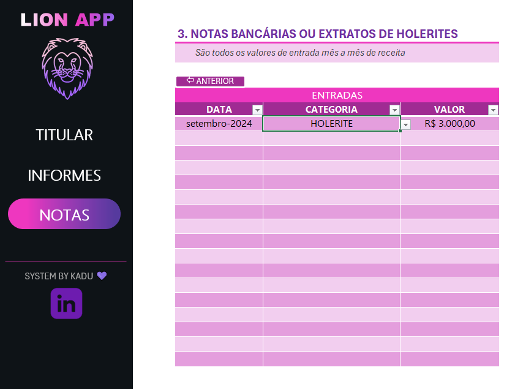

# 🧾 Projeto IR – Lion App em Excel para Organização da Declaração de Imposto de Renda

Este projeto apresenta o **Lion App**, uma ferramenta desenvolvida em **Microsoft Excel** com o objetivo de auxiliar pessoas físicas na organização das informações necessárias para a declaração do imposto de renda. A proposta consiste em um agregador simples, funcional e validado, com interface intuitiva e menus de preenchimento assistido.

---

## ✅ Funcionalidades

- Registro estruturado de dados do contribuinte.
- Entrada de dados de até três instituições financeiras.
- Classificação mensal por tipos de rendimento.
- Interface com abas separadas por finalidade.
- Validações automáticas para evitar erros de preenchimento.
- Navegação facilitada e visual organizado.

---

## 📄 Estrutura do Arquivo

O arquivo principal do projeto é:

- `Projeto IR.xlsx`

Ele contém três abas principais:

### 1️⃣ **Titular**
Preenchimento com os dados pessoais do contribuinte (pessoa física), incluindo CPF, nome completo, data de nascimento, entre outros.

🖼️ Exemplo:

---

### 2️⃣ **Informes**
Tela destinada à inserção de dados extraídos dos informes bancários. O usuário pode preencher dados de até **três instituições financeiras**, incluindo CNPJ, saldo, rendimentos, e tipo de aplicação.

🖼️ Exemplo:

---

### 3️⃣ **Notas**
Área para o registro mensal de valores recebidos, organizados em três categorias:
- Holerite (rendimento formal com vínculo)
- CNPJ (pessoa jurídica)
- Free lance (atividade informal/autônoma)

🖼️ Exemplo:

---
## 📝 Como Usar

1. Faça o download do arquivo **Projeto IR.xlsx**.
2. Abra a planilha no Microsoft Excel.
3. Preencha os campos nas três abas conforme as instruções.
4. Utilize os dados consolidados como base para sua declaração de IR.

---

## ⚙️ Requisitos

- Microsoft Excel (preferencialmente com suporte a macros ativado)
- Sistema operacional Windows ou compatível com Excel completo
- Recomenda-se salvar uma cópia de segurança antes de uso

---

## 🤝 Contribuições

Sugestões de melhoria, correções e funcionalidades adicionais podem ser propostas por meio de *issues* ou *pull requests* neste repositório.

---

## 📜 Licença

Este projeto é destinado ao uso pessoal e educacional. Não substitui a orientação profissional de um contador. Consulte a licença para mais detalhes.

---

